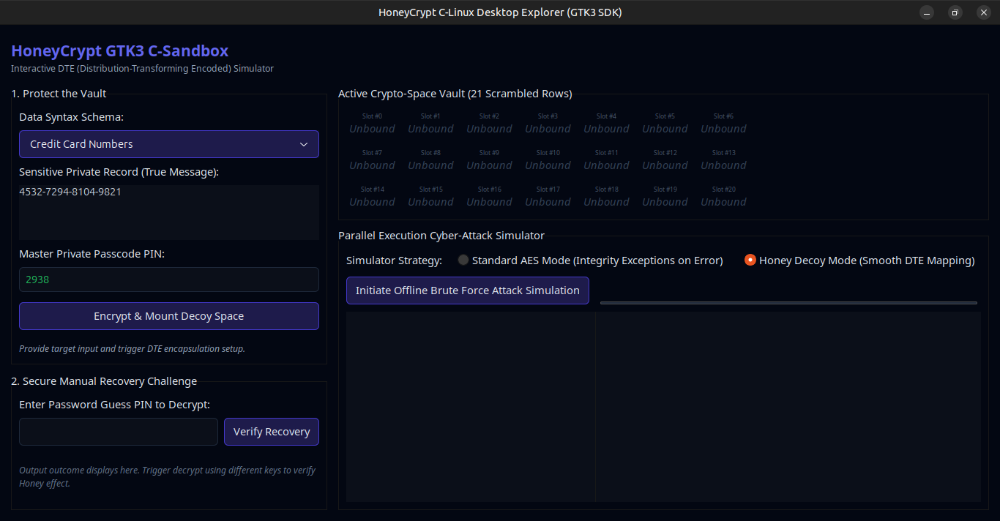

<div align="center">

<a href="https://github.com/effjy/honeycrypt/"></a>

DTE-Based Plausible-Decoy Encryption Vault

[](https://opensource.org/licenses/MIT)
[](https://www.linux.org)
[](https://gtk.org)
[](https://en.wikipedia.org/wiki/C99)
[](https://www.gnu.org/software/make/)
[](paper.pdf)
[](https://doi.org/10.6084/m9.figshare.32537733)
[]()

</div>

> *"Neutralizing offline brute-force attacks by replacing authentication errors with plausible decoys."*

---

## 📖 Table of Contents
- [Screenshot](#screenshot)
- [What is HoneyCrypt?](#what-is-honeycrypt)
- [System Prerequisites](#system-prerequisites)
- [Compilation & Build](#compilation--build)
- [How to Use the Program](#how-to-use-the-program)
- [Academic Paper](#academic-paper)
- [Repository Structure](#repository-structure)
- [License](#license)

---
## screenshot
## 📸 Screenshot



*Figure: The HoneyCrypt main interface showing the 21-slot decoy grid, schema selector, and brute-force attack simulator panel.*

---

## 🧠 What is HoneyCrypt?

HoneyCrypt is a lightweight, high-performance GUI application written in **pure ANSI C** that implements the **Distribution-Transforming Encryption (DTE)** paradigm (also known as *Honey Cryptography*) using the native **GTK3 SDK**.

Traditional symmetric encryption systems (like AES-GCM or AES-CBC with HMAC) secure private records by ensuring confidentiality, but they **fail explicitly** when decryption is attempted with incorrect passcodes. This explicit feedback allows adversaries to run rapid, automated offline brute-force attacks. 

**HoneyCrypt counters this** by mapping incorrect passcodes to highly plausible, syntactically correct decoy plaintexts—leaving attackers with **no mathematical means** of validating whether they found the true key.

---

## 📋 System Prerequisites

To build and run the GTK-3 GUI C desktop application locally, you must install the standard C development toolchain (`gcc`, `make`) and the GTK-3 developer header libraries.

### For Debian / Ubuntu Systems:
```bash
sudo apt-get update
sudo apt-get install build-essential libgtk-3-dev pkg-config
```

### For Fedora / CentOS / RHEL Systems:
```bash
sudo dnf groupinstall "Development Tools"
sudo dnf install gtk3-devel pkgconf-pkg-config
```

### For Arch Linux Systems:
```bash
sudo pacman -S base-devel gtk3 pkgconf
```

---

## 🛠️ Compilation & Build Workflows

We provide a streamlined, warning-free `Makefile` optimized with standard `-O2` native compiler flags.

To build the executable, open a terminal in the project's root folder and run:
```bash
make build
```

This will run the GCC compiler and produce a native standalone binary named `honeycrypt`:
```bash
gcc -Wall -Wextra -O2 -o honeycrypt honeycrypt.c `pkg-config --cflags --libs gtk+-3.0` -lm
```

To clean up build artifacts and delete the binary, run:
```bash
make clean
```

---

## 🚀 How to Use the Program

To start the application, execute the compiled binary from your terminal:
```bash
./honeycrypt
```

### Step-by-Step Security Walkthrough

#### 1. Encrypting & Securing your Secret
1. **Choose a Message Schema**: Under **"1. Protect the Vault"**, pick a syntax schema template from the dropdown (e.g., *Credit Card Numbers*, *Crypto Mnemonic Seeds*, *Target GPS Coordinates*, *Medical Diagnostics Log*, or *Cryptographic Master Keys*).
2. **Input your Private Record**: Edit/paste your true sensitive record in the text area (e.g., your real vault keys or coordinates).
3. **Set the Passcode key**: Set your numeric or alphanumeric master PIN/password (e.g., `2938`).
4. **Trigger Generation**: Click **"Encrypt & Mount Decoy Space"**. 
   - The application constructs a 21-node active layout grid.
   - It hashes your PIN using `dte_hash()` to place your true message in a deterministic slot.
   - It populates the remaining 20 slots with realistic fakes that pass verification checks (like the Luhn formula for credit cards or valid BIP39 vocabularies).

#### 2. Manual Decryption Challenge
In section **"2. Secure Manual Recovery Challenge"**, test different PIN entries:
- **Correct Key**: Type your correct PIN (e.g., `2938`) and click **"Verify Recovery"**. The vault will return your genuine plaintext.
- **Incorrect Key**: Type any random wrong PIN (e.g., `9999`) and click **"Verify Recovery"**. Rather than erroring out, HoneyCrypt deterministically maps your wrong passcode to a plausible decoy in the storage grid. No mathematical exceptions are raised.

#### 3. Simulating an Offline Brute-Force Sweep
At the bottom of the interface, you can test both security modes against an automated brute-force cracking script:
1. **Select Standard AES Mode**: Click **"Initiate Offline Brute Force"**. Watch the Progress Console. Since traditional AES throws integrity exception faults for every wrong guess, the cracker script instantly isolates the single working key.
2. **Select Honey Decoy Mode**: Click the attack simulator again. Watch as *every single* candidate tried returns successfully with a plausible-looking output. When the sweep finishes, the attacker has collected 30 different, perfectly structured files and is completely blind to which one represents the true record.

---

## 📄 Academic Paper

The full research monograph accompanying this implementation is available in this repository and on Figshare:

### [📑 Download the Paper (PDF)](paper.pdf) | [](https://doi.org/10.6084/m9.figshare.32537733)

**Title:** *HoneyCrypt: Distribution-Transforming Encryption and Plausible-Decoy Schemes for Symmetric Cryptosystems*

**Authors:** Jean-Francois Lachance-Caumartin

**Published:** 2026-06-01 (Figshare Preprint)

**Contents:**
- Mathematical formalism of Distribution-Transforming Encryption (DTE)
- Security proofs of adversary verification blindness
- Decoy synthesizer specifications (Luhn-valid credit cards, BIP39 seeds, GPS coordinates, medical records)
- Experimental evaluation and entropy analysis
- References to honey cryptography literature

The LaTeX source (`paper.tex`) is also included for reproducibility.

---

## 📁 Repository Structure

```
honeycrypt/
├── honeycrypt.c          # Main application source (ANSI C + GTK3)
├── Makefile              # Build configuration with clean targets
├── paper.pdf             # Full academic research paper (PDF)
├── paper.tex             # LaTeX source of the paper
├── screenshot.png        # Application UI screenshot
└── README.md             # This file
```

---

## ⚖️ License

This project is licensed under the **MIT License** - see below for details:

```
MIT License

Copyright (c) 2026 Jean-Francois Lachance-Caumartin

Permission is hereby granted, free of charge, to any person obtaining a copy
of this software and associated documentation files (the "Software"), to deal
in the Software without restriction, including without limitation the rights
to use, copy, modify, merge, publish, distribute, sublicense, and/or sell
copies of the Software, and to permit persons to whom the Software is
furnished to do so, subject to the following conditions:

The above copyright notice and this permission notice shall be included in all
copies or substantial portions of the Software.

THE SOFTWARE IS PROVIDED "AS IS", WITHOUT WARRANTY OF ANY KIND, EXPRESS OR
IMPLIED, INCLUDING BUT NOT LIMITED TO THE WARRANTIES OF MERCHANTABILITY,
FITNESS FOR A PARTICULAR PURPOSE AND NONINFRINGEMENT. IN NO EVENT SHALL THE
AUTHORS OR COPYRIGHT HOLDERS BE LIABLE FOR ANY CLAIM, DAMAGES OR OTHER
LIABILITY, WHETHER IN AN ACTION OF CONTRACT, TORT OR OTHERWISE, ARISING FROM,
OUT OF OR IN CONNECTION WITH THE SOFTWARE OR THE USE OR OTHER DEALINGS IN THE
SOFTWARE.
```

---

## 📧 Contact & Citation

**Author:** Jean-Francois Lachance-Caumartin  
**ORCID:** 0009-0005-6377-1675  
**Email:** jeanfrancoislachancecaumartin@gmail.com  
**Figshare:** [10.6084/m9.figshare.32537733](https://doi.org/10.6084/m9.figshare.32537733)

If you use HoneyCrypt in your research or security infrastructure, please cite:

```bibtex
@manual{lachance2026honeycrypt,
  title     = {HoneyCrypt: A Portable C and GTK3 Implementation of 
               Distribution-Transforming Encryption with Plausible-Decoy Defense},
  author    = {Jean-Francois Lachance-Caumartin},
  year      = {2026},
  doi       = {10.6084/m9.figshare.32537733},
  url       = {https://github.com/effjy/honeycrypt}
}
```

---

**Made with 🔐 and C99**
